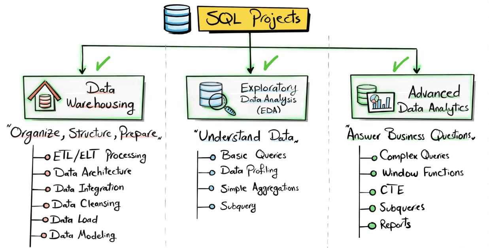
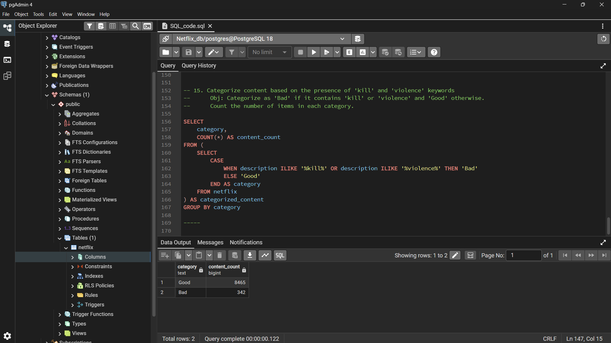

# Netflix Content Analysis using PostgreSQL

Netflix content analysis using PostgreSQL, showcasing SQL, data exploration, aggregation, string manipulation, window functions, and business reporting.

## Project Summary

This project analyzes Netflix's catalog of movies and TV shows using PostgreSQL. The objective is to demonstrate practical SQL skills commonly used in Data Analytics and Business Intelligence roles while extracting actionable insights from a real-world dataset.

Through a series of business-driven questions, this project explores content distribution, audience ratings, release trends, regional content production, genre analysis, and content categorization. The analysis leverages PostgreSQL features such as aggregations, window functions, string manipulation, subqueries, and conditional logic to generate meaningful business insights.

---

## SQL Project Landscape



Among the three major categories of SQL projects, this repository focuses on **Data Analytics using SQL**. The goal is to solve business problems, uncover trends, and generate insights that support data-driven decision-making.

---

## Tech Stack

- PostgreSQL
- SQL
- pgAdmin
- Kaggle Dataset

---

## Skills Demonstrated

- Data Cleaning
- Exploratory Data Analysis (EDA)
- Business Reporting
- Aggregation Functions
- Window Functions
- String Manipulation
- Subqueries
- Conditional Logic
- Data Transformation
- PostgreSQL Querying

---

## Dataset


### Source

- **Dataset:** Netflix Movies and TV Shows
- **Provider:** Kaggle
- **Link:** https://www.kaggle.com/datasets/shivamb/netflix-shows

The dataset contains information about Netflix movies and TV shows, including titles, directors, cast members, countries, release years, ratings, genres, durations, and descriptions.

---

## Database Schema

```sql
DROP TABLE IF EXISTS netflix;

CREATE TABLE netflix
(
	show_id	VARCHAR(7),
	cinema_type	VARCHAR(10),
	title	VARCHAR(150),
	director VARCHAR(210),
	casts VARCHAR(1000),
	country VARCHAR(150),
	date_added VARCHAR(50),
	release_year INT,
	rating	VARCHAR(10),
	duration	VARCHAR(15),
	listed_in	VARCHAR(100),
	description VARCHAR(250)
);
```

---

## SQL Concepts Used

This project demonstrates the use of:

- SELECT Statements
- WHERE Clauses
- GROUP BY
- ORDER BY
- Aggregate Functions
- COUNT()
- Window Functions
- RANK()
- CASE Statements
- Subqueries
- STRING_TO_ARRAY()
- UNNEST()
- SPLIT_PART()
- Type Casting
- Date Functions
- Pattern Matching (LIKE / ILIKE)

---

# Business Problems & Solutions

## 1. Count the Number of Movies vs TV Shows

### Business Question

How is Netflix's catalog distributed between Movies and TV Shows?

```sql
SELECT cinema_type,
       COUNT(*) AS total_content
FROM netflix
GROUP BY cinema_type;
```

**Objective:** Determine the distribution of content types available on Netflix.

---

## 2. Find the Most Common Rating for Movies and TV Shows

### Business Question

What are the most frequently assigned ratings for Movies and TV Shows?

```sql
SELECT cinema_type,
       rating
FROM
(
	SELECT
		cinema_type,
		rating,
		COUNT(*) AS total,
		RANK() OVER(
			PARTITION BY cinema_type
			ORDER BY COUNT(*) DESC
		) AS ranking
	FROM netflix
	GROUP BY 1,2
) t1
WHERE ranking = 1;
```

**Objective:** Identify the dominant audience rating category for each content type.

---

## 3. List All Movies Released in 2020

### Business Question

Which movies were released in 2020?

```sql
SELECT *
FROM netflix
WHERE cinema_type = 'Movie'
  AND release_year = 2020;
```

**Objective:** Analyze content released during a specific year.

---

## 4. Find the Top 5 Countries with the Most Content

### Business Question

Which countries contribute the most content to Netflix?

```sql
SELECT
	UNNEST(STRING_TO_ARRAY(country, ', ')) AS distinct_country,
	COUNT(*) AS total
FROM netflix
GROUP BY 1
ORDER BY 2 DESC
LIMIT 5;
```

**Objective:** Identify the leading content-producing countries.

---

## 5. Identify the Longest Movie

### Business Question

Which movie has the longest runtime?

```sql
SELECT *
FROM netflix
WHERE cinema_type = 'Movie'
ORDER BY SPLIT_PART(duration, ' ', 1)::INT DESC
LIMIT 1;
```

**Objective:** Find the longest movie available in the dataset.

---

## 6. Find Content Added in the Last 5 Years

### Business Question

What content has been added to Netflix during the last five years?

```sql
SELECT *
FROM netflix
WHERE TO_DATE(date_added, 'Month DD YYYY')
      >= CURRENT_DATE - INTERVAL '5 YEARS';
```

**Objective:** Analyze recent additions to the Netflix catalog.

---

## 7. Find All Content Directed by Rajiv Chilaka

### Business Question

Which titles were directed by Rajiv Chilaka?

```sql
SELECT *
FROM netflix
WHERE director ILIKE '%Rajiv Chilaka%';
```

**Objective:** Retrieve all content associated with a specific director.

---

## 8. List TV Shows with More Than 5 Seasons

### Business Question

Which TV shows have more than five seasons?

```sql
SELECT *,
	   SPLIT_PART(duration, ' ', 1) AS season_num
FROM netflix
WHERE cinema_type = 'TV Show'
  AND SPLIT_PART(duration, ' ', 1)::NUMERIC > 5;
```

**Objective:** Identify long-running television series.

---

## 9. Count Content Items by Genre

### Business Question

Which genres are most common on Netflix?

```sql
SELECT
	UNNEST(STRING_TO_ARRAY(listed_in, ', ')) AS genre,
	COUNT(*) AS total
FROM netflix
GROUP BY 1
ORDER BY 2 DESC;
```

**Objective:** Understand genre distribution across the platform.

---

## 10. Top 5 Years with the Highest Share of Netflix Content Released in India

### Business Question

Which years contributed the highest percentage of Indian content?

```sql
SELECT
	EXTRACT(
		YEAR FROM TO_DATE(date_added, 'Month DD YYYY')
	) AS year,

	COUNT(*) AS yearly_content,

	ROUND(
		COUNT(*)::NUMERIC /
		(
			SELECT COUNT(*)
			FROM netflix
			WHERE country = 'India'
		)::NUMERIC * 100,
		2
	) AS avg_content_per_year

FROM netflix
WHERE country = 'India'
GROUP BY 1
ORDER BY avg_content_per_year DESC
LIMIT 5;
```

**Objective:** Measure yearly contributions to Netflix's Indian content catalog.

---

## 11. List All Documentary Movies

### Business Question

Which titles are categorized as documentaries?

```sql
SELECT *
FROM netflix
WHERE listed_in ILIKE '%Documentaries%';
```

**Objective:** Retrieve all documentary-related content.

---

## 12. Find Content Without a Director

### Business Question

Which titles do not have director information?

```sql
SELECT *
FROM netflix
WHERE director IS NULL;
```

**Objective:** Identify missing director records for data quality analysis.

---

## 13. Count Movies Featuring Salman Khan in the Last 10 Years

### Business Question

How many movies featuring Salman Khan were released during the last decade?

```sql
SELECT COUNT(*) AS total_movies
FROM netflix
WHERE casts ILIKE '%Salman Khan%'
  AND cinema_type = 'Movie'
  AND release_year >= EXTRACT(YEAR FROM CURRENT_DATE) - 10;
```

**Objective:** Measure the actor's recent presence within the Netflix catalog.

---

## 14. Top 10 Actors Appearing in Indian Movies

### Business Question

Which actors have appeared most frequently in Indian-produced movies?

```sql
SELECT
	UNNEST(STRING_TO_ARRAY(casts, ',')) AS actor,
	COUNT(*)
FROM netflix
WHERE country = 'India'
  AND cinema_type = 'Movie'
GROUP BY actor
ORDER BY COUNT(*) DESC
LIMIT 10;
```

**Objective:** Identify the most frequently featured actors in Indian movies.

---

## 15. Categorize Content Using Keywords

### Business Question

How much content contains keywords associated with violence?

```sql
SELECT
	category,
	COUNT(*) AS content_count
FROM
(
	SELECT
		CASE
			WHEN description ILIKE '%kill%'
			  OR description ILIKE '%violence%'
			THEN 'Bad'
			ELSE 'Good'
		END AS category
	FROM netflix
) categorized_content
GROUP BY category;
```

**Objective:** Classify content based on the presence of specific keywords in descriptions.

---

## Sample Execution Environment



---

## Key Insights

- Movies constitute a significant portion of Netflix's overall catalog.
- Content ratings reveal the primary audience demographics targeted by Netflix.
- The United States, India, and several other countries dominate content production.
- Documentary content represents an important segment of Netflix's library.
- Long-running TV shows contribute significantly to user engagement and retention.
- Keyword-based categorization can help identify potentially sensitive content themes.

---

## Business Impact

The analysis demonstrates how SQL can be used to:

- Analyze content distribution across a streaming platform.
- Support content acquisition and production decisions.
- Understand audience targeting through content ratings.
- Evaluate regional content trends and market presence.
- Generate executive-level business reports from raw data.
- Transform raw datasets into actionable insights.

---

## Repository Structure

```text
Data-Analytics-with-PostgreSQL/
│
├── SQL_code.sql
├── README.md
│
└── png/
    ├── logo.png
    ├── PostgreSQL_interface.png
    └── Types_of_SQL_projects.png
```

---

## How to Run

1. Download the Netflix dataset from Kaggle.
2. Create a PostgreSQL database.
3. Execute the table creation script.
4. Import the dataset into the `netflix` table.
5. Run the SQL queries provided in `SQL_code.sql`.
6. Analyze the generated results and insights.

---

## Author

### Sahaj K.

Aspiring Data Analyst passionate about SQL, Analytics, Data Visualization, and Business Intelligence.

This project is part of my data analytics portfolio and demonstrates practical SQL skills used in real-world analytical workflows.
